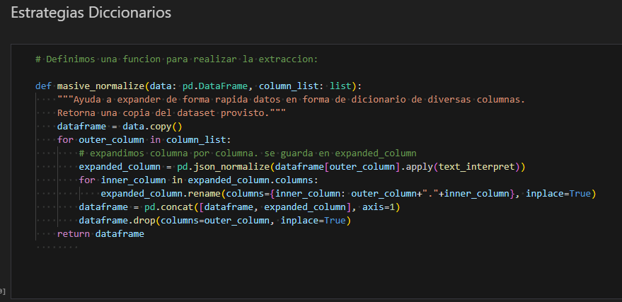
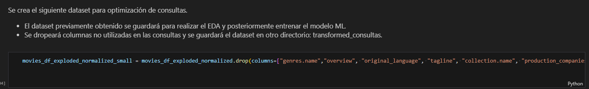
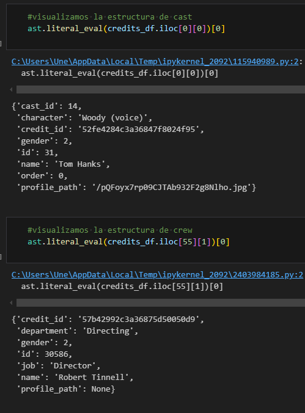
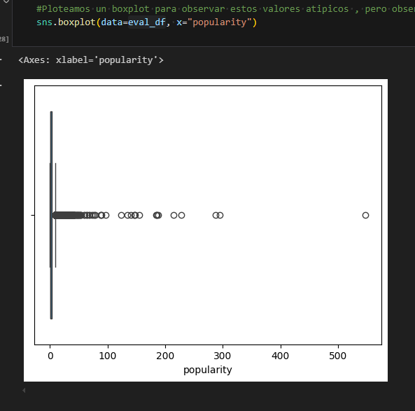
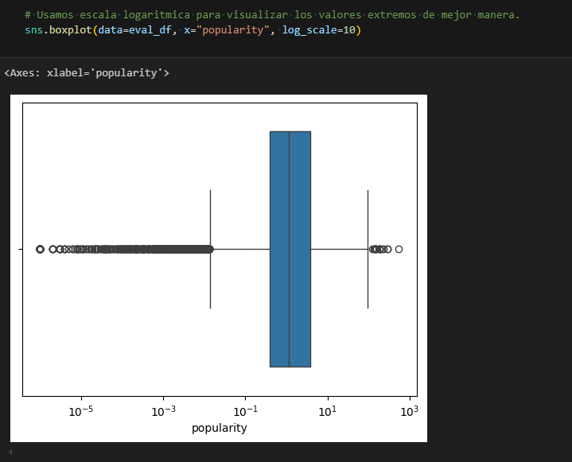
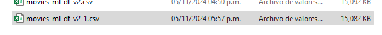
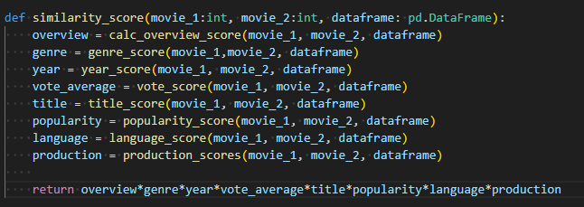
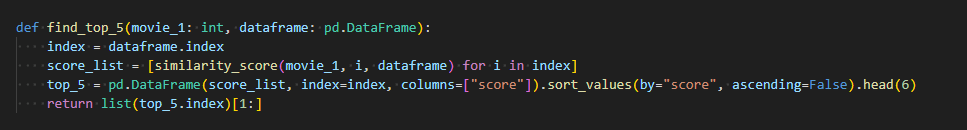

# Proyecto Datascience ML Ops

Este repositorio contiene proyectos asociados a la carrera de datascience de Henry.

## Contenido
- Consigna
- ETL
- API
- EDA
- Algoritmo de recomendación

## Cosigna

https://github.com/soyHenry/fe-ct-pimlops2

Data: 3 archivos csv con información de peliculas, directores y actores.

Problemas identificados: 
- Gran cantidad de data. Los archivos no pueden ser cargados a github.
- Presencia de data anidada. Debe reestructurarse.
- Presencia de datos tipo TEXTO, que requiere procesamiento en gran medida para poder realizar un correcto análisis..
- Render tiene limitaciones de procesamiento y memoria, por lo cual se debe optimizar el código.

## Proceso ETL

Se explica la transformación realizada en ambos datasets
### Dataset movies

Lo primero que notamos al extraer la información en un dataframe son las estructuras anidadas. 
Se creó dos funciones para realizar la extracción de estas columnas usando explode, json_normalize y eval.

 

Posteriormente se aplica estas funciones y se logra expandir el dataset para análisis.

Acciones posteriores:
- Imputación de valores: Se imputaron valores conforme la consigna, usando DataFrame.fillna()
- Creación de columna "return".
- Creacion de la columna "release_year" usando dt.year
- Eliminación columnas video,imdb_id,adult,original_title,poster_path y homepage.

Este dataset se guarda para proseguir con el EDA.
Creamos un dataset "small" para optimizar las consultas realizadas a la API.

### Dataset credits_df

Visualizamos que este dataset contiene los IDs de las peliculas y dos columnas que tienen el cast y el crew.

Observaciones: 

- El cast y el crew son la lista de actores y la lista de personal que trabajó en la pelicula respectivamente.
- Al intentar atacar el dataset con las funciones anteriormente definidas (explode , json_normalize, etc), nos encontramos con un dataset inmenso.
- A raiz de esto, optamos por separar cast y crew en datasets distintos.
- Así mismo, se procede a normalizar y a borrar columnas innecesarias.

#### Estructuras de los datos anidados en cada columna(crew y cast)

Al finalizar se observa que los datasets redujeron su tamaño considerablemente.

## Proceso EDA

En el proceso EDA tomamos el dataset previamente guardado y comenzamos a explorar patrones y preparar nuestra data para ser introducida en nuestro algoritmo machine learning.

Dentro de los procesos de datos se usaron:

### Procesos numéricos:
- Visualizacion de matriz de correlación con heatmap.
- Reducción de variables correlacionadas.
- Análisis de distribución de valores.
- Eliminación de columnas con valores faltantes en gran medida. i.e: budget.
- Normalización de valores con distribuciones anormales o outliers.
- Se usaron métodos de re-escalado logarítmico 

#### Antes:

#### Despues:

### Procesos NLP:
- Imputacion de valores nulos.
- Conversión a minúsculas.
- Eliminación de Stopwords
- Lenmatización
- Vectorización TF-IDF
- Reducción de dimensionalidad con PCA
- Concatenación de columnas con valores similares, para evitar el sobreprocesamiento.
- Volvemos a agrupar la data en estructuras anidadas y eliminamos duplicados.

#### Visualización final:

#### Tamaño final del archivo: 15megas

31-10: 

## Algoritmo de recomendación

Para el algoritmo de recomendación se usa principalmente "cosine-similarity", ya que gran parte de la data que se evaluará es de tipo "texto".

Teniamos pensado preprocesar una matriz de similitud entre todas las peliculas del dataset, pero esto supone un archivo inmenso que no 
puede ser cargado en render. 

Por ende, tomamos el siguiente camino:
1. Crear una estrategia para comparar 2 peliculas. La métrica es un score de similaridad.
2. Extrapolar esta estrategia, para que al brindar 1 pelicula, se calcule una matriz que tenga información de esta pelicula vs otras peliculas.
3. Se ordena el dataset final y se extrae los valores mas relevantes.

Para el punto 1 optamos por computar por separado: 

    - Cosine Similirity para los componentes de OVERVIEW_PCA. 
    - Cosine similarity para genres, title+collection_name, production_companies, original_language+available_languages, country_origin.
    - Diferencia entre release - year y posterior escalado.
    - Diferencia entre vote_average y ote_count_log, posterior escalado.
    - Diferencia entre popularity_log y escalado.
    - Diferencia entre v y escalado.
    - Creación de una función que junte todas las métricas y brinde una métrica final.

Para el segundo y tercer punto se construye un dataframe y se ordena por scores.

## Posibles puntos de mejora:
- En un entorno real se requiere de respuestas rapidas. Es posible se requiera contar con espacio suficiente para guardar matrices preprocesadas.
- Para un entorno real se requieren hacer combinaciones exhaustivas para verificar que paso es más optimo y arroja mejores recomendaciones.
- Es necesario aplicar A/B testing, ya que los usuarios finales es quienes realmente definen si un sistema es bueno o no.
- Posiblemente se pueda resumir los tiempos de procesamiento eliminando ciertas columnas o uniendolas, ya que no estariamos iterando nuevamente para hacer procesos.
- Debido al corto tiempo no fue posible disponer de mayores escenarios de pruebas y mejora.
